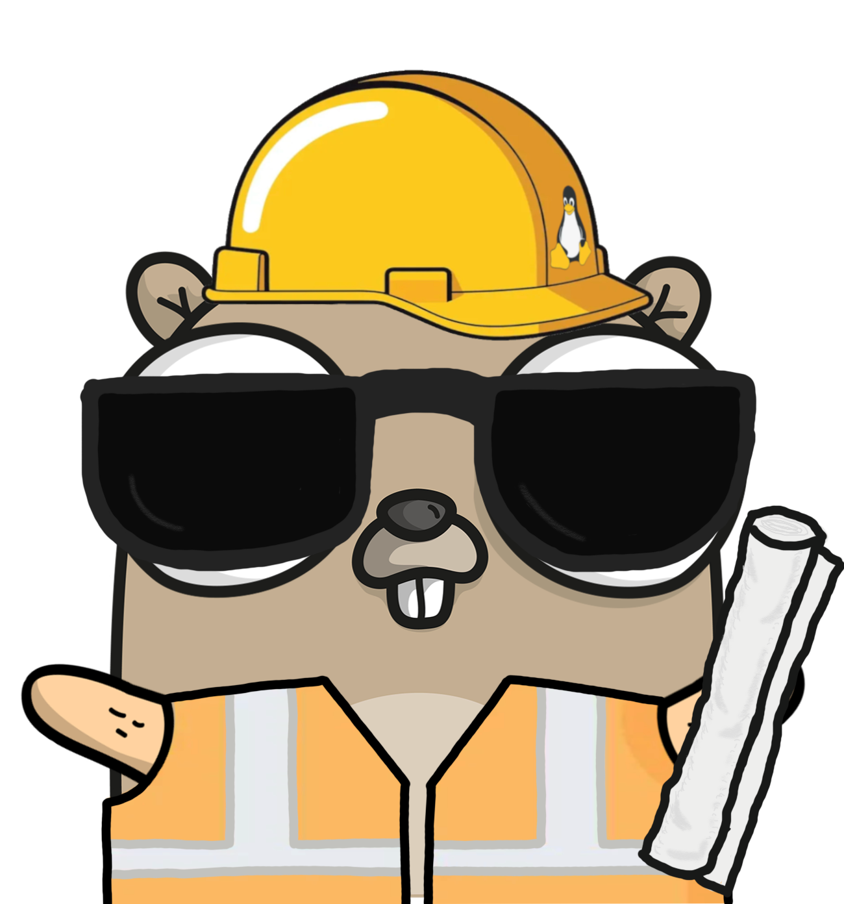

# 🐧 Hi, I'm KoiFresh

I like building software using technologies which take a look not only on the
user experience but also on the developer experience. I'm interesed in 🖨️ 3d
printing and 💻 programming, mostly on linux based systems. I would highly
recommend checking out my personal website 🌎 <https://mayer.sh/> or my latest
project 🔔 <https://dieklingel.com/> for more information. I really enjoy using
emojis, thats why they are all over my profile.

If you would like to reach me, you could send me an 📫 email to <kai@mayer.sh>.
